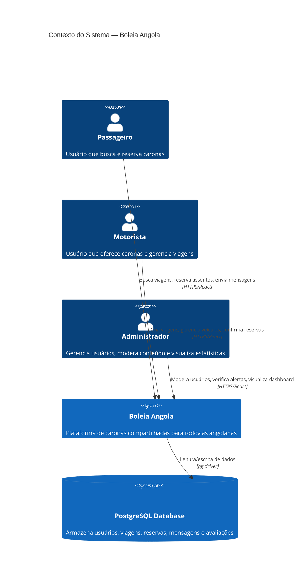

# Arquitetura do Sistema — Boleia Angola

**Gerado em:** 2026-07-16T20:05:00Z  
**Nível de documentação:** essencial  
**Revisão:** 1.0

---

## Visão Geral

**Boleia Angola** é uma plataforma full-stack de caronas compartilhadas para rodovias angolanas, seguindo arquitetura similar ao BlaBlaCar.

### Stack Tecnológico

| Camada | Tecnologia |
|--------|------------|
| **Frontend** | React + TypeScript + Vite + Tailwind CSS |
| **Backend** | Node.js + Express + JavaScript |
| **Banco de Dados** | PostgreSQL |
| **Autenticação** | JWT (JSON Web Tokens) |
| **Infraestrutura** | Nginx (proxy) + PM2 (process manager) + Docker |

### Arquitetura

**Padrão:** Monolito modular com separação frontend/backend  
**Deploy:** Nginx reverse proxy → PM2 (backend port 5000) + Vite dev server (frontend)  
**Database:** PostgreSQL com 16 tabelas, migrations organizadas em pasta `migrations/`

---

## Componentes Principais

### Frontend (React)

```
src/
├── pages/           # Páginas por role (admin, auth, driver, passenger, profile, public)
├── components/      # Componentes reutilizáveis (layout, profile, sections, ui)
├── contexts/        # AuthContext, NotificationContext
├── hooks/           # Custom hooks
├── lib/             # api.ts (cliente HTTP Axios)
└── models/          # Tipos TypeScript
```

**Entrada:** `src/main.tsx` → `App.tsx` (React Router)

### Backend (Express)

```
server/src/
├── routes/          # 12 módulos de rotas (auth, rides, bookings, profiles, etc.)
├── middleware/      # auth.js, rate-limit.js
├── config/          # db.js (conexão PostgreSQL)
└── uploads/         # Arquivos estáticos (avatars, documentos)
```

**Entrada:** `server/src/index.js`

### Banco de Dados (PostgreSQL)

**Tabelas principais (9):**
1. `profiles` — Usuários (id, email, full_name, phone, role, password_hash, avatar_url, verification_status, rating)
2. `rides` — Viagens (driver_id, origin_city, destination_city, departure_time, price_per_seat, total_seats, available_seats, vehicle_id, status, waypoints)
3. `bookings` — Reservas (ride_id, passenger_id, seats_booked, total_price, status)
4. `vehicles` — Veículos (owner_id, make, model, year, color, license_plate, capacity, is_active)
5. `messages` — Mensagens (sender_id, receiver_id, content, is_read)
6. `notifications` — Notificações (user_id, title, content, type, is_read, link)
7. `alerts` — Alertas de segurança (reporter_id, target_user_id, target_ride_id, reason, status)
8. `reviews` — Avaliações (booking_id, reviewer_id, reviewee_id, rating, comment)
9. `driver_applications` — Solicitações de aprovação como motorista

**Migrations:** `migrations/` + `auth_migration.sql` + `init_fixed.sql` + `rls_policies.sql`

---

## Diagrama C4 — Contexto (Nível 1)



---

## APIs e Integrações

### API REST Interna (Express)

**48 endpoints** distribuídos em 12 módulos:

| Módulo | Endpoints | Responsabilidade |
|--------|-----------|------------------|
| `auth` | POST /register, POST /login, GET /me | Autenticação JWT |
| `rides` | POST /, PATCH /:id, DELETE /:id, GET /my-rides, GET /search, GET /:id/passengers | CRUD de viagens + busca |
| `bookings` | POST /, GET /passenger, GET /driver, PATCH /:id/status | Reservas de assentos |
| `profiles` | GET /, GET /me, GET /:id, PUT /:id, POST /avatar, POST /phone/verify | Gerenciamento de perfil |
| `vehicles` | POST /, GET /my-vehicles, GET /:id, PATCH /:id, DELETE /:id | CRUD de veículos |
| `messages` | POST /, GET /conversation/:id, GET /unread, PATCH /:id/read | Mensagens entre usuários |
| `notifications` | GET /, PUT /:id/read | Notificações do sistema |
| `alerts` | POST /, GET /my-alerts, GET /admin/pending, PATCH /:id/status | Reportar problemas |
| `driver` | GET /stats, POST /apply, GET /status | Solicitação de driver |
| `reviews` | POST /, GET /ride/:id, GET /user/:id | Avaliações pós-viagem |
| `admin` | GET /stats, GET /users, GET /rides, POST /users/:id/verify, POST /users/:id/role, DELETE /users/:id | Painel administrativo |
| `uploads` | POST /avatar, POST /document | Upload de arquivos |

### Integrações Externas

**Nenhuma** — sistema totalmente self-hosted, sem dependência de APIs externas.

---

##三层架构

```
┌──────────────────────────────────────────────────────┐
│                    Client Layer                       │
│  ┌─────────────┐  ┌─────────────┐  ┌─────────────┐   │
│  │  Passenger  │  │   Driver    │  │    Admin    │   │
│  │   (React)   │  │   (React)   │  │   (React)   │   │
│  └──────┬──────┘  └──────┬──────┘  └──────┬──────┘   │
│         │                │                │          │
│         └────────────────┴────────────────┘          │
│                        │ HTTPS                       │
└────────────────────────┼─────────────────────────────┘
                         │
┌────────────────────────┼─────────────────────────────┐
│                    Application Layer                  │
│                         │                             │
│              ┌──────────▼──────────┐                  │
│              │   Express Backend   │                  │
│              │   (Node.js/TS)      │                  │
│              ├─────────────────────┤                  │
│              │  Controllers (12    │                  │
│              │  route modules)     │                  │
│              ├─────────────────────┤                  │
│              │  Middleware         │                  │
│              │  (auth, rate-limit) │                  │
│              └──────────┬──────────┘                  │
│                         │ pg driver                    │
└─────────────────────────┼─────────────────────────────┘
                          │
┌─────────────────────────┼─────────────────────────────┐
│                      Data Layer                       │
│                         │                             │
│              ┌──────────▼──────────┐                  │
│              │   PostgreSQL DB     │                  │
│              │   (16 tabelas)      │                  │
│              │   - profiles        │                  │
│              │   - rides           │                  │
│              │   - bookings        │                  │
│              │   - vehicles        │                  │
│              │   - messages        │                  │
│              │   - notifications   │                  │
│              │   - alerts          │                  │
│              │   - reviews         │                  │
│              │   - driver_app...   │                  │
│              └─────────────────────┘                  │
└───────────────────────────────────────────────────────┘
```

---

## Estados e Transições

### Ride Status
```
scheduled → active | cancelled
active → completed
completed → (final state)
cancelled → (final state)
```

### Booking Status
```
pending → confirmed | rejected | cancelled
confirmed → cancelled
rejected → (final state)
```

### Alert Status
```
pending → reviewed → resolved | dismissed
```

---

## Segurança

### ✅ Implementado
- Password hashing com **bcrypt** (salt rounds: 10)
- **JWT** tokens com expiry (7 dias)
- **Ownership verification** em todas as rotas
- **Role-based access control** (middleware adminAuth)
- **SQL injection prevention** (prepared statements via pg)
- **Input validation** (regex, type checks)
- **Rate limiting** (express-rate-limit)
- **Helmet** security headers
- **CORS** configurado

### ⚠️ Vulnerabilidades

| Severidade | Descrição | Localização |
|------------|-----------|-------------|
| **CRÍTICA** | JWT secret fallback hardcoded: `process.env.JWT_SECRET || 'boleia_secret_key'` | `server/src/routes/auth.js:134` |

### 🔴 Lacunas Identificadas
- Nenhuma **2FA** implementada
- Verificação de email não funciona (apenas regex)
- Rate limiting em produção depende de Nginx
- CSP restritiva pode quebrar recursos externos

---

## System Metrics

| Categoria | Confirmed 🟢 | Inferred 🟡 | Gap 🔴 |
|-----------|--------------|-------------|--------|
| Funções/APIs | 48 | 2 | 0 |
| Entidades | 15 | 1 | 0 |
| Regras de negócio | 25 | 2 | 1 |
| Segurança | 12 | 1 | 1 |
| **TOTAL** | **100** | **6** | **2** |

**Confiança geral:** 🟢🟢🟢🟢🟢 95% confirmadas

---

## Dívidas Técnicas Identificadas

1. **JWT secret hardcoded** — Crítico para produção
2. **Código duplicado** — Validação de telefone repetida em múltiplos módulos
3. **Test coverage baixo** — ~15 arquivos de teste para 181 arquivos totais (~8%)
4. **Sem 2FA** — Falha de segurança em autenticação

---

## Próximos Passos

1. **Detective** — Extrair regras de negócio implícitas
2. **Data Master** — Documentação completa do schema PostgreSQL
3. **Designer** — Mapear telas e fluxos de UI
4. **Inspector** — Validar cobertura da documentação
5. **Audit** — Revisão cruzada entre artefatos
6. **Regression check** — Verificar consistência com código atual

---

**Documento gerado por:** Reversa Architect  
**Confiança escalada:** 🟢 CONFIRMADO | 🟡 INFERIDO | 🔴 LACUNA