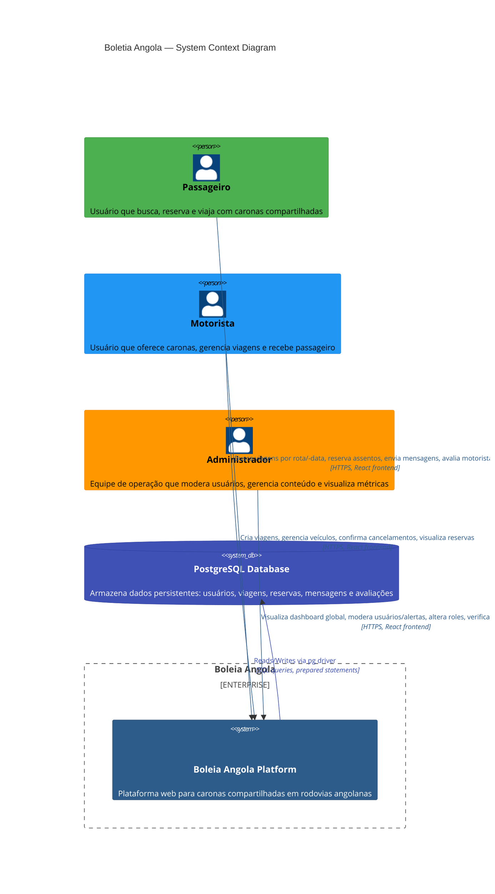

# Diagrama C4 — Contexto (Nível 1)

**Projeto:** Boleia Angola  
**Gerado em:** 2026-07-16T20:05:00Z  
**Nível:** C4 Level 1 — System Context

---

## Visão Geral

Este diagrama mostra o sistema Boleia Angola no contexto dos atores (personas) e sistemas externos com os quais interage.



---

## Personas (Atores)

### Passageiro
- **Objetivo:** Encontrar caronas econômicas para viagens rodoviárias
- **Ações principais:**
  - Buscar viagens por origem, destino e data
  - Visualizar detalhes da viagem (preço, assentos, motorista, avaliação)
  - Reservar assentos
  - Enviar mensagens ao motorista
  - Acompanhar status da reserva
  - Avaliar motoristas após viagem

### Motorista
- **Objetivo:** Oferecer caronas para dividir custos de viagem
- **Ações principais:**
  - Criar viagens com rota, data, preço e assentos disponíveis
  - Gerenciar perfil e documentos
  - Visualizar reservas de passageiro
  - Confirmar ou cancelar reservas
  - Cancelar viagem (se não houver reservas confirmadas)
  - Avaliar passageiros após viagem

### Administrador
- **Objetivo:** Operar a plataforma, moderar conteúdo e garantir segurança
- **Ações principais:**
  - Visualizar estatísticas globais (usuários, viagens, booking rate, receita)
  - Gerenciar usuários (aprovar, suspender, alterar role, deletar)
  - Moderar alertas de segurança reportados por usuários
  - Verificar documentos de motoristas
  - Analisar reviews e resolver disputas
  - Acessar logs e auditoria do sistema

---

## Sistema Principal: Boleia Angola Platform

**Descrição:** Aplicação web full-stack para caronas compartilhadas em rodovias angolanas, seguindo modelo BlaBlaCar.

**Tecnologias:**
- **Frontend:** React + TypeScript + Vite + Tailwind CSS
- **Backend:** Node.js + Express + JavaScript
- **Database:** PostgreSQL
- **Autenticação:** JWT (JSON Web Tokens)

**Funcionalidades principais:**
1. **Busca de viagens** — Filtros por cidade origem, destino, data, assentos disponíveis
2. **Reserva de assentos** — Sistema de booking com confirmação padrão
3. **Mensagens** — Chat entre motorista e passageiro da mesma viagem
4. **Avaliações** — Sistema de rating 1-5 após viagens completadas
5. **Perfis** — Foto, descrição, histórico de viagens e rating
6. **Alertas de segurança** — Reportar comportamento inadequado
7. **Admin panel** — Moderar usuários, conteúdos e resolver problemas

---

## Sistema de Banco de Dados: PostgreSQL

**Descrição:** Banco de dados relacional que armazena todos os dados da plataforma.

**Tabelas principais:**
- `profiles` — Dados de usuários (nome, email, telefone, role, avatar, verificação)
- `rides` — Viagens oferecidas por motoristas
- `bookings` — Reservas de assentos por passageiros
- `vehicles` — Veículos cadastrados pelos motoristas
- `messages` — Mensagens entre usuários
- `notifications` — Notificações do sistema
- `alerts` — Reportes de segurança
- `reviews` — Avaliações após viagens
- `driver_applications` — Solicitações de aprovação como motorista

**Características:**
- **Migrations:** versionadas e organizadas em pasta `migrations/`
- **RLS policies:** Row-level security para controle de acesso
- **Triggers:** `created_at`/`updated_at` automáticos
- **Indexes:** Otimizados para busca de viagens e joins

---

## Fluxos Principais

### Fluxo de Reserva de Viagem

```
Passageiro → [Busca viagens] → Plota listas de viagens compatíveis
         → [Seleciona viagem] → Mostra detalhes (preço, assentos, motorista)
         → [Reserva assentos] → [POST /bookings] → Verifica disponibilidade
         → [Confirmar] ← [Booking criado com status=pending]
         → [Notificação] → Motorista recebe notificação
```

### Fluxo de Criação de Viagem

```
Motorista → [Preenche dados da viagem] → [POST /rides]
         → Validações: data futura, preço > 0, assentos entre 1-15
         → [Verifica ownership do veículo] → Falha se veículo não pertencente ao motorista
         → [Ride criada com status=scheduled]
         → [Notificação] → Passageiros próximos recebem notification
```

### Fluxo de denúncia (Alert)

```
Qualquer usuário → [Reporta usuário/viagem] → [POST /alerts]
               → [Preenche motivo e descrição]
               → [Alert criado com status=pending]
               → [Admin recebe notification]
               → Admin → [Review alert] → [PATCH /alerts/:id/status]
               → [Status → reviewed → resolved/dismissed]
```

---

## Considerações de Segurança

### Autenticação
- Todos os endpoints außer `POST /register`, `POST /login`, `GET /me` requerem JWT
- Token expira após 7 dias
- Middleware `auth.js` verifica token e popula `req.user`

### Autorização
- **Ownership checks:** Usuário só pode editar seus próprios recursos
- **Role-based access:** `adminAuth` middleware restringe rotas administrativas
- **Row-level security:** Políticas PostgreSQL previnem acesso a dados de outros usuários

### Vulnerabilidade Crítica
⚠️ **JWT secret hardcoded em produção** — `server/src/routes/auth.js:134`  
```javascript
const JWT_SECRET = process.env.JWT_SECRET || 'boleia_secret_key';
```
→ Requer correção imediata: usar variável de ambiente obrigatória, sem fallback.

---

## Limite do Sistema

**Escopo incluído:**
- Aplicação web responsiva (desktop + mobile)
- API REST para operações CRUD
- Autenticação JWT
- Sistema de notificações (polling 30s)
- Upload de arquivos (avatars, documentos)
- Painel administrativo
- Migrations e seeds de banco de dados

**Escopo excluído:**
- Aplicação nativa móvel (apelo web responsiva)
- Integrações com GPS/mapas (apenas cidades como waypoints)
- Pagamentos online (sistema futuro)
- SMS/Email de confirmação (apenas in-app notifications)
- Suporte a múltiplos idiomas (interface em Português)

---

**Diagrama gerado por:** Revisa Architect  
**Formato:** Mermaid.js para renderização em markdown  
**Confiança:** 🟢 CONFIRMADO  
**Nível C4:** 1 — System Context