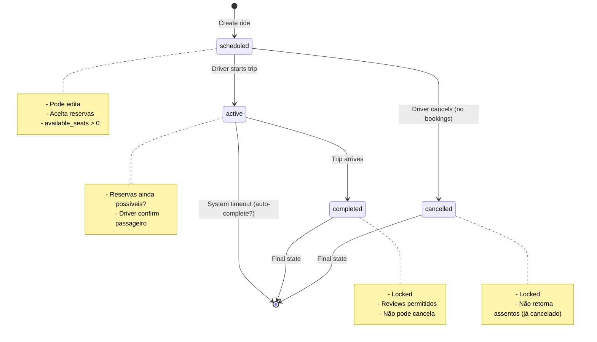
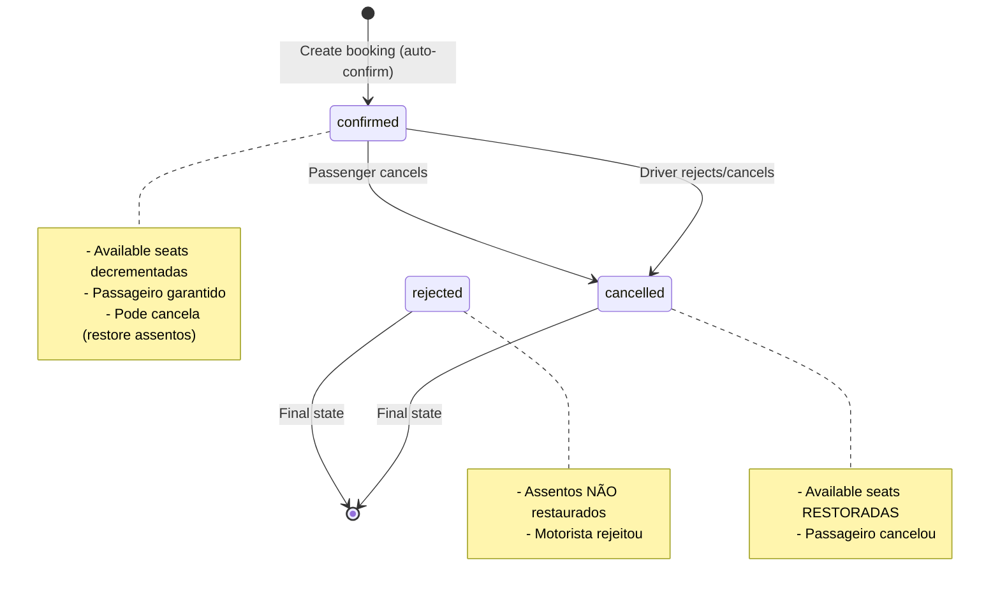
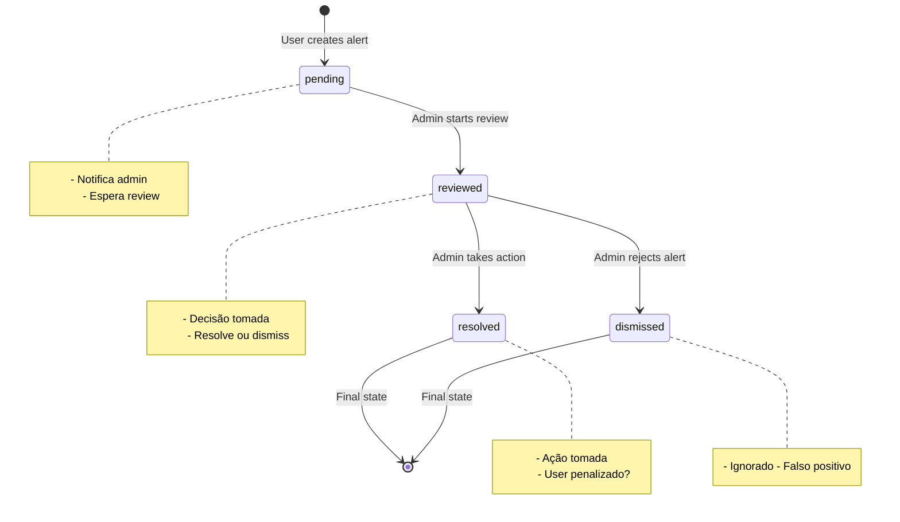
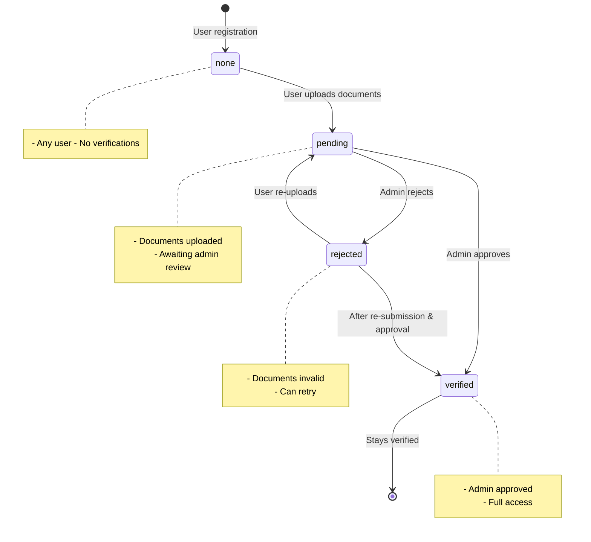
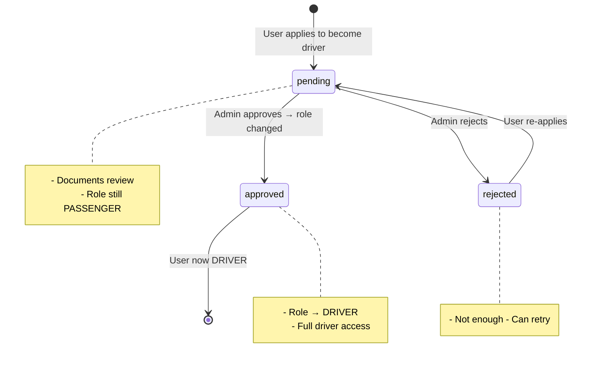
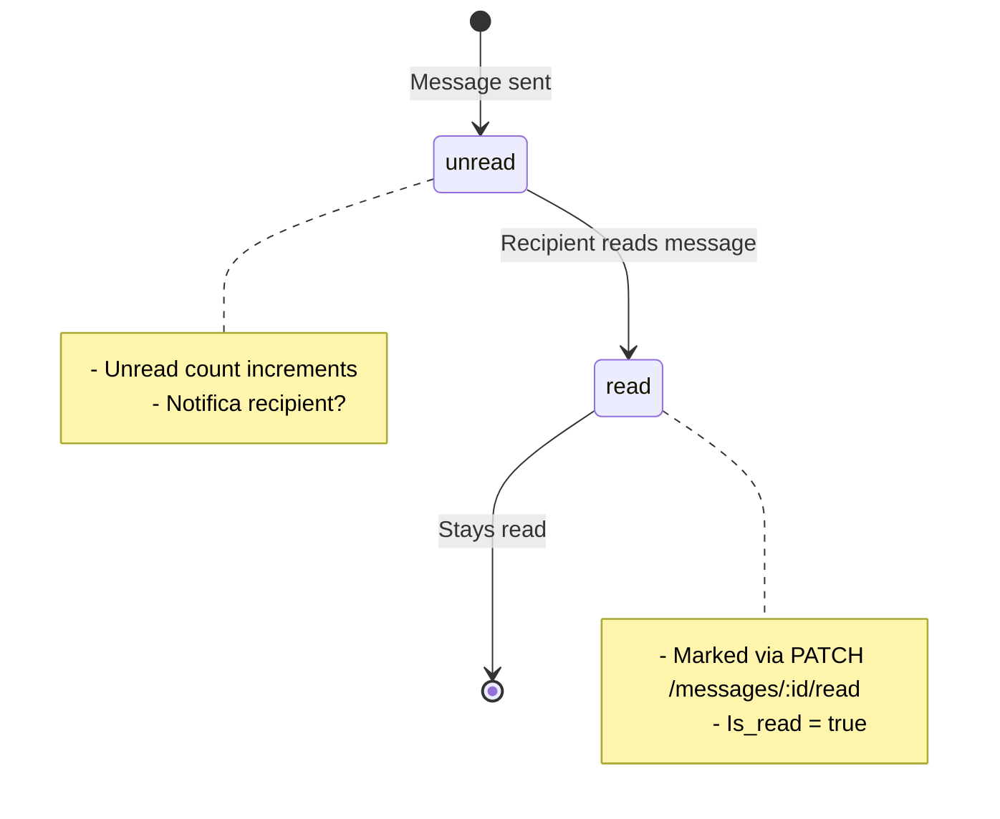
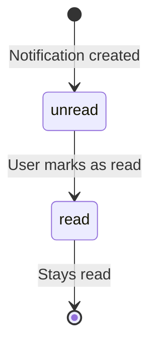

# Máquinas de Estado — Boleia Angola

**Gerado em:** 2026-07-16T20:15:00Z  
**Agente:** Detective  
**Nível de documentação:** essencial

---

## Visão Geral

Este documento descreve todas as máquinas de estado (state machines) identificadas no sistema Boleia Angola. Cada entidade com campos de status/estado tem sua própria máquina definida.

---

## 1. Ride (Viagem) — Máquina de Estado Principal

**Entidade:** `rides`  
**Campo de estado:** `status`  
**Confiança:** 🟢 CONFIRMADO

### Estados Possíveis

| Estado | Descrição |
|--------|-----------|
| `scheduled` | Viagem planejada, ainda não começou |
| `active` | Viagem em andamento |
| `completed` | Viagem finalizada com sucesso |
| `cancelled` | Viagem cancelada pelo motorista |

### Transições Permitidas



### Transições Detalhadas

| De | Para | Gatilho | Conditions | Ações |
|----|------|---------|------------|-------|
| `null` | `scheduled` | Criar viagem | `driver authenticated`, `departure_time > NOW()` | INSERT ride, `available_seats = total_seats` |
| `scheduled` | `active` | Iniciar viagem | `driver owns ride`, `departure_time <= NOW()` | UPDATE status = 'active' |
| `scheduled` | `cancelled` | Cancelar viagem | `driver owns ride`, **NO confirmed bookings** | UPDATE status = 'cancelled' |
| `scheduled` | `scheduled` | Editar viagem | `driver owns ride`, valid fields | UPDATE fields (não status) |
| `active` | `completed` | Finalizar viagem | `driver owns ride` | UPDATE status = 'completed' |
| `completed` | `completed` | — | **FINAL STATE** | Nenhuma transição |
| `cancelled` | `cancelled` | — | **FINAL STATE** | Nenhuma transição |

### Regras de Validação

**R.1.1 — Não cancelar com reservas confirmadas**
```
IF status = 'scheduled' AND DELETED booking WHERE ride_id = $1 AND status = 'confirmed'
THEN RAISE ERROR "Não é possível cancelar viagem com passageiros confirmados"
```

**R.1.2 — Transição inválida**
```
IF (status = 'completed' OR status = 'cancelled') AND requested_status != current_status
THEN RAISE ERROR "Transición de status inválida: {current} -> {requested}"
```

---

## 2. Booking (Reserva) — Máquina de Estado

**Entidade:** `bookings`  
**Campo de estado:** `status`  
**Confiança:** 🟢 CONFIRMADO

### Estados Possíveis

| Estado | Descrição |
|--------|-----------|
| `pending` | Reserva aguardando confirmação (não usada — cria direto confirmed) |
| `confirmed` | Reserva confirmada, passageiro garantido |
| `rejected` | Reserva rejeitada pelo motorista |
| `cancelled` | Reserva cancelada (por passageiro ou motorista) |

### Transições Permitidas



### Transições Detalhadas

| De | Para | Gatilho | Conditions | Ações |
|----|------|---------|------------|-------|
| `null` | `confirmed` | POST /bookings | `available_seats >= seats_booked`, `no duplicate` | INSERT booking, **UPDATE rides.available_seats -= seats** |
| `confirmed` | `cancelled` | Passenger/Motorista cancela | `user owns booking or ride` | UPDATE status = 'cancelled', **UPDATE rides.available_seats += seats** |
| `confirmed` | `rejected` | Motorista rejeita | `driver owns ride` | UPDATE status = 'rejected' |
| `rejected` | `rejected` | — | **FINAL STATE** | Nenhuma transição |
| `cancelled` | `cancelled` | — | **FINAL STATE** | Nenhuma transição |

### Regras de Validação

**R.2.1 — Disponibilidade de assentos**
```
SELECT available_seats FROM rides WHERE id = $1
IF available_seats < seats_booked
THEN RAISE ERROR "Não há assentos disponíveis suficientes"
```

**R.2.2 — Duplicidade**
```
SELECT id FROM bookings WHERE ride_id = $1 AND passenger_id = $2 AND status = 'confirmed'
IF EXISTS
THEN RAISE ERROR "Você já reservou esta viagem"
```

**R.2.3 — Restauração de assentos**
```
IF booking.status = 'confirmed' AND new_status IN ('cancelled', 'rejected')
THEN UPDATE rides SET available_seats = available_seats + booking.seats_booked WHERE id = booking.ride_id
```

### Atenção — Comportamento Observado

⚠️ **Ambiguidade no código:** O sistema cria reservas diretamente com status `confirmed` (não `pending`). O estado `pending` existe como tipo TypeScript mas NÂO é usado na criação.

⚠️ **Rejeição vs Cancelamento:** Quando motorista rejeita, assentos NÃO são restaurados (code line `/bookings.js:149-154` verifica `booking.status === 'confirmed'` mas rejeição também deveria restaurar).

---

## 3. Alert (Alerta) — Máquina de Estado

**Entidade:** `alerts`  
**Campo de estado:** `status`  
**Confiança:** 🟢 CONFIRMADO

### Estados Possíveis

| Estado | Descrição |
|--------|-----------|
| `pending` | Alerta aguardando review pelo admin |
| `reviewed` | Admin revisou o alerta |
| `resolved` | Problema resolvido (ação tomada) |
| `dismissed` | Alerta ignorado (falso positivo) |

### Transições Permitidas



### Transições Detalhadas

| De | Para | Gatilho | Conditions | Ações |
|----|------|---------|------------|-------|
| `null` | `pending` | User creates alert | `authenticated user`, `valid reason` | INSERT alert |
| `pending` | `reviewed` | Admin starts review | `admin authenticated` | UPDATE status = 'reviewed' |
| `reviewed` | `resolved` | Admin resolves | `admin authenticated` | UPDATE status = 'resolved' |
| `reviewed` | `dismissed` | Admin dismisses | `admin authenticated` | UPDATE status = 'dismissed' |
| `resolved` | `resolved` | — | **FINAL STATE** | Nenhuma transição |
| `dismissed` | `dismissed` | — | **FINAL STATE** | Nenhuma transição |

### Regras de Validação

**R.3.1 — Apenas admin pode mudar status**
```
IF user.role != 'ADMIN' AND requested_status != current_status
THEN RAISE ERROR "Apenas administradores podem alterar status de alertas"
```

---

## 4. User (Profile) — Verificação Status

**Entidade:** `profiles`  
**Campo de estado:** `verification_status`  
**Confiança:** 🟢 CONFIRMADO

### Estados Possíveis

| Estado | Descrição |
|--------|-----------|
| `none` | Usuário não iniciou verificação |
| `pending` | Documentos enviados, aguardando review |
| `verified` | Documentos aprovados pelo admin |
| `rejected` | Documentos rejeitados, pode enviar novamente |

### Transições Permitidas



### Transições Detalhadas

| De | Para | Gatilho | Conditions | Ações |
|----|------|---------|------------|-------|
| `null` | `none` | User registration | — | INSERT profile, `verification_status = 'none'` |
| `none` | `pending` | User uploads documents | `authenticated user`, `valid file` | UPDATE verification_status = 'pending' |
| `pending` | `verified` | Admin approves | `admin authenticated` | UPDATE verification_status = 'verified' |
| `pending` | `rejected` | Admin rejects | `admin authenticated` | UPDATE verification_status = 'rejected' |
| `rejected` | `pending` | User re-uploads | `authenticated user`, `new documents` | UPDATE verification_status = 'pending' |

---

## 5. Driver Application — Aplicação para Motorista

**Entidade:** `driver_applications`  
**Campo de estado:** `status`  
**Confiança:** 🟡 INFERIDO (baseado em `/driver.js`)

### Estados Possíveis

| Estado | Descrição |
|--------|-----------|
| `pending` | Aplicação enviada, aguardando review |
| `approved` | Aprovado, usuário agora é driver |
| `rejected` | Rejeitado, precisa re-aplicar |

### Transições Possíveis (inferidas)



### Observações

⚠️ **Status exato não confirmado:** Código `/driver.js` existe mas não foi lido totalmente. Estados podem variar.

---

## 6. Message (Mensagem) — Status de Leitura

**Entidade:** `messages`  
**Campo de estado:** `is_read` (booleano)  
**Confiança:** 🟢 CONFIRMADO

### Estados Possíveis

| Estado | Descrição |
|--------|-----------|
| `false` | Mensagem não lida |
| `true` | Mensagem lida |

### Transições



### Transições Detalhadas

| De | Para | Gatilho | Conditions | Ações |
|----|------|---------|------------|-------|
| `null` | `false` (unread) | POST /messages | `sender authenticated`, `recipient exists` | INSERT message, `is_read = false` |
| `false` | `true` | PATCH /messages/:id/read | `recipient owns message` | UPDATE is_read = true |

---

## 7. Notification — Status de Leitura

**Entidade:** `notifications`  
**Campo de estado:** `is_read` (booleano)  
**Confiança:** 🟢 CONFIRMADO

### Estados Possíveis

| Estado | Descrição |
|--------|-----------|
| `false` | Notificação não lida |
| `true` | Notificação lida |

### Transições



---

## 8. Vehicle — Status de Atividade

**Entidade:** `vehicles`  
**Campo de estado:** `is_active` (booleano)  
**Confiança:** 🟢 CONFIRMADO

### Estados Possíveis

| Estado | Descrição |
|--------|-----------|
| `true` | Veículo ativo, disponível para viagens |
| `false` | Veículo inativo, não aparece em buscas |

### Transições

| De | Para | Gatilho | Conditions | Ações |
|----|------|---------|------------|-------|
| `null` | `true` | Veículo criado | `owner authenticated` | INSERT vehicle, `is_active = true` |
| `true` | `false` | Proprietário desativa | `owner authenticated` | UPDATE is_active = false |
| `false` | `true` | Proprietário reativa | `owner authenticated` | UPDATE is_active = true |

---

## Resumen Estatístico

| Entidade | Campo de Estado | Estados | Transições | Confianza |
|----------|-----------------|---------|------------|-----------|
| Ride | `status` | 4 | 5 | 🟢 CONFIRMADO |
| Booking | `status` | 4 | 4 | 🟢 CONFIRMADO |
| Alert | `status` | 4 | 4 | 🟢 CONFIRMADO |
| Profile | `verification_status` | 4 | 5 | 🟢 CONFIRMADO |
| DriverApplication | `status` | 3 | 3 | 🟡 INFERIDO |
| Message | `is_read` | 2 | 2 | 🟢 CONFIRMADO |
| Notification | `is_read` | 2 | 2 | 🟢 CONFIRMADO |
| Vehicle | `is_active` | 2 | 3 | 🟢 CONFIRMADO |

**Total:** 8 máquinas de estado identificadas  
**Confiança:** 7 🟢 confirmadas, 1 🟡 inferida

---

**Documento gerado por:** Reversa Detective  
**Confiança escalonada:** 🟢 CONFIRMADO | 🟡 INFERIDO | 🔴 LACUNA